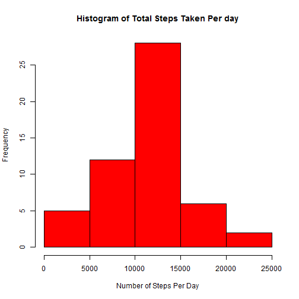
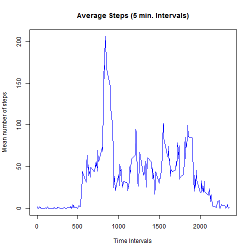
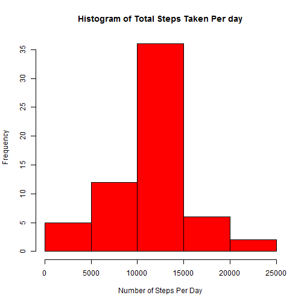
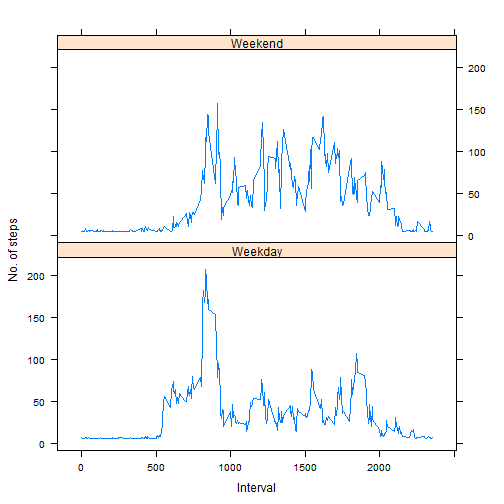

# Reproducible Research: Peer Assessment 1

## Loading and preprocessing the data

### Loading the data


```r
activity.data<-read.csv(file = "activity.csv",header = TRUE,sep = ",")
```

### Preprocessing the data


```r
activity.data$date <- as.Date(activity.data$date,"%Y-%m-%d")
```

## What is mean total number of steps taken per day?

Ignoring missing values in the dataset

```r
activity.data.withoutNA<-activity.data[!is.na(activity.data$steps),]
```

Total number of steps taken per day

```r
total.steps.per.day <- tapply(activity.data.withoutNA$steps, activity.data.withoutNA$date,sum)
```

Histogram of the total number of steps taken each day

```r
hist(total.steps.per.day, col="red", xlab="Number of Steps Per Day", ylab="Frequency", main="Histogram of Total Steps Taken Per day")
```

 

Mean of the total number of steps taken per day

```r
mean(total.steps.per.day)
```

```
## [1] 10766.19
```

Median of the total number of steps taken per day

```r
median(total.steps.per.day)
```

```
## [1] 10765
```

## What is the average daily activity pattern?

Time series plot of the 5-minute interval

```r
steps.interval <- aggregate(steps ~ interval, data=activity.data, FUN=mean)
plot(steps.interval, type="l", xlab = "Time Intervals", ylab = "Mean number of steps", main = "Average Steps (5 min. Intervals)", col = "blue")
```

 

5-minute interval that contains the maximum number of steps

```r
steps.interval$interval[which.max(steps.interval$steps)]
```

```
## [1] 835
```

## Imputing missing values
total number of missing values in the dataset

```r
sum(is.na(activity.data$steps))
```

```
## [1] 2304
```

Fill missing values with the average interval across all days

```r
activity.data.withNA<-activity.data[is.na(activity.data$steps),]
activity.data.withNA$steps=mean(steps.interval$steps)
```

Create a new dataset

```r
new.activity.data=rbind(activity.data.withoutNA,activity.data.withNA)
```
The New Total number of steps taken per day

```r
new.total.steps.per.day <- tapply(new.activity.data$steps, new.activity.data$date,sum)
```

The New Histogram of the total number of steps taken each day

```r
hist(new.total.steps.per.day, col="red", xlab="Number of Steps Per Day", ylab="Frequency", main="Histogram of Total Steps Taken Per day")
```

 

The New Mean of the total number of steps taken per day

```r
mean(new.total.steps.per.day)
```

```
## [1] 10766.19
```

The New Median of the total number of steps taken per day

```r
median(new.total.steps.per.day)
```

```
## [1] 10766.19
```

## Are there differences in activity patterns between weekdays and weekends?
Create a new factor variable in the dataset

```r
new.activity.data$type.of.day <- ifelse(weekdays(new.activity.data$date) == "Saturday" | weekdays(new.activity.data$date) == "Sunday", "Weekend", "Weekday")
```

Panel plot

```r
new.steps.interval <- aggregate(new.activity.data$steps,by=list(new.activity.data$interval, new.activity.data$type.of.day),FUN=mean)
names(new.steps.interval) <- c("interval","type.of.day","steps")
xyplot(steps~interval | type.of.day, new.steps.interval,type="l", layout=c(1,2), xlab="Interval",ylab = "No. of steps")
```

 

average number of steps taken, averaged across all weekday days or weekend days

```r
tapply(new.steps.interval$steps, new.steps.interval$type.of.day, FUN = mean)
```

```
##  Weekday  Weekend 
## 35.61058 42.36640
```
